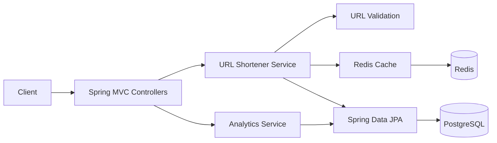

# Architecture Overview

## Objective

Build a production-ready AI-assisted URL shortener as a Java 21 Spring Boot modular monolith
with PostgreSQL persistence, Redis read-through cache, click analytics, Swagger UI, Docker
Compose support, and automated tests.

## Components

## Request Flow

1. `POST /api/v1/urls` validates `originalUrl`, detects duplicates, generates a random Base62
   short code, stores the URL in PostgreSQL, and writes the Redis cache entry.
2. `GET /{shortCode}` accepts Base62-style short code paths, reads Redis first, falls back to
   PostgreSQL on cache miss, records analytics, and returns `302 Found` with the original URL as
   the `Location` header.
3. `GET /api/v1/analytics/{shortCode}` reads persisted click counts and recent click metadata.
4. `GET /actuator/health` is provided by Spring Actuator.

## Key Decisions

| Decision | Rationale | Trade-off |
| --- | --- | --- |
| Spring Boot modular monolith | Simple deployment with clear package boundaries | Not independently deployable services |
| PostgreSQL unique constraints | Enforces duplicate URL and short-code integrity | Requires handling rare race conditions |
| Redis read-through cache | Low-latency redirects with database fallback | Analytics still needs PostgreSQL URL identity |
| Random Base62 short codes | Avoids sequential enumeration | Requires bounded collision retry |
| `200 OK` for duplicate creates | Makes create idempotent for the same original URL | Clients must distinguish `200` from new `201` |
| Hibernate schema update | Fast local setup for assignment review | Use Flyway or Liquibase for strict production migrations |

## Package Boundaries

- `controller`: HTTP endpoints and status codes
- `dto`: immutable request and response payloads
- `entity`: JPA persistence model
- `repository`: Spring Data JPA interfaces
- `service` and `service.impl`: URL use cases
- `cache`: Redis access
- `analytics`: click capture and reporting
- `validation`: URL validation rules
- `mapper`: DTO mapping
- `exception`: API exception handling
- `config`: application and OpenAPI configuration
- `util`: small reusable helpers

## Validation Strategy

- Unit tests cover URL creation, duplicate detection, invalid URLs, redirect cache behavior, and
  missing short codes.
- Controller tests cover HTTP status codes, validation, redirect headers, and analytics payloads.
- Repository tests use PostgreSQL Testcontainers.
- Integration tests run the Spring Boot app with PostgreSQL and Redis Testcontainers.
